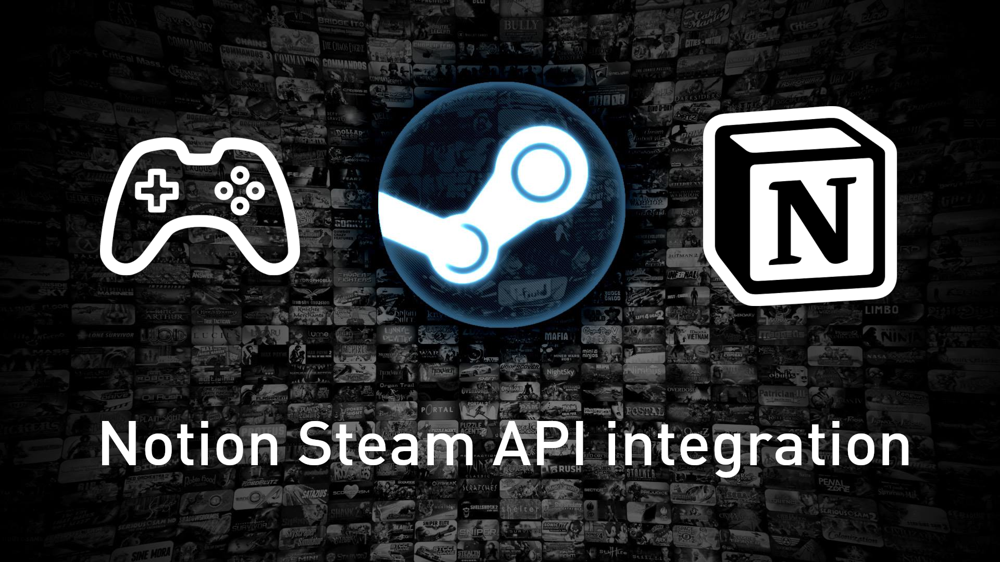

# Notion Steam API Integration



Notion integration for automatically updating database entries containing a `Steam App ID` with data from the Steam API.

## Setup

Run `npm install` to install the required dependencies first.

Following this, create a `config.json` file in the root directory of the project and fill it with your desired [configuration](#configuration).

If you haven't already done so, you can obtain a Notion integration key by creating an (internal) Notion integration for your workspace.
You can follow [this guide](https://developers.notion.com/docs/create-a-notion-integration) to learn how to do so.
You will need this key to run the integration locally.

**IMPORTANT: Don't forget to connect the integration to your database, as described in the guide! Otherwise, the integration won't work.**

## Usage

After providing the `config.json` [configuration](#configuration) file, you can run the script using

```bash
node index.js
```

The integration will search the database for new entries that have the `Steam App ID` field (the name of this property must be defined in the configuration file) set to a value other than `null` and then fetch the corresponding data from the Steam API.
Following this, the database entry will be updated with cleaned up data from the API, such as Steam user review scores or the game's tags, following the provided configuration.

You are able to have the integration running in the background whilst editing the database.
You can also have database entries without the `Steam App ID` field set, these will be ignored by the integration.

If you change the configuration to include new game properties, you will need to run the integration with the `forceReset` flag set to `true` in the configuration, in order to also set the new value for all previously discovered games.

There currently is no way to reset a value that was previously set in the Notion database.

## Configuration

### Schema validation

The project provides a JSON validation schema for the required configuration file, which makes sure that all required information is provided.

The schema can be found in the `config.schema.json` file and used within your `config.json` by adding the following property:

```json
"$schema": "config.schema.json"
```

*NOTE: The script will test your provided `config.json` against this schema, so make sure your configuration is valid.*

### Properties

The following is a list of all configuration items, their defaults and the values they can take.

#### Top-level properties

<details>
<summary><code>notionIntegrationKey</code></summary>

The secret integration key for your Notion integration. Find it on your integration dashboard after creating a new integration on https://www.notion.so/my-integrations.

| Type | Default value | Possible values | Required |
|---|---|---|---|
| `string` | `""` | A valid Notion integration key | Yes |
</details>

<details>
<summary><code>notionDatabaseId</code></summary>

The ID of the database you want to run the integration on. You can find the ID in the URL of your database, e.g. https://www.notion.so/myworkspace/your-database-id.

| Type | Default value | Possible values | Required |
|---|---|---|---|
| `string` | `""` | A valid Notion database ID | Yes |
</details>

<details>
<summary><code>updateInterval</code></summary>

The interval in which the integration will check for updates to your Notion database. The value is in milliseconds. Must be at least 60000 (1 minute).

| Type | Default value | Possible values | Required |
|---|---|---|---|
| `integer` | 60000 | Integers >= 60000 | Yes |
</details>

<details>
<summary><code>steamAppIdProperty</code></summary>

The name of the property in your Notion database that contains the Steam App ID of the games.

| Type | Default value | Possible values | Required |
|---|---|---|---|
| `string` | `"Steam App ID"` | Any string | Yes |
</details>

<details>
<summary><code>forceReset</code></summary>

If true, the integration will reset the local database, fetch all Steam App ID's from the Notion database and refresh all game properties. This may take longer, depending on the size of your Notion database.

| Type | Default value | Possible values | Required |
|---|---|---|---|
| `boolean` | `false` | `true` or `false` | No |
</details>

<details>
<summary><code>gameProperties</code></summary>

Which game properties should be fetched when a new Steam game is detected, and the name of the corresponding field in the Notion database.

| Type | Default value | Possible values | Required |
|---|---|---|---|
| `object` | See item below | See sections below | Yes, and at least one property set. |

```json
"gameProperties": {
	"gameName": {
		"enabled": true,
		"notionProperty": "Game Name",
		"isPageTitle": true
	},
	"coverImage": true,
	"gameIcon": true,
	"releaseDate": {
		"enabled": true,
		"notionProperty": "Release Date",
		"format": "date"
	},
	"reviewScore": {
		"enabled": true,
		"notionProperty": "Review Score"
	},
	"tags": {
		"enabled": true,
		"notionProperty": "Tags"
	}
}
```
</details>

#### gameProperties

<details>
<summary><code>gameName</code></summary>

The name of the game as it appears on Steam.

| Type | Default value | Possible values | Required |
|---|---|---|---|
| `object` | See item below | See sections below | No |

```json
"gameName": {
	"enabled": true,
	"notionProperty": "Game Name",
	"isPageTitle": true
}
```

<h3>Possible values</h3>

<h4><code>enabled</code></h4>

Whether or not the name of the game should be set in the database.

| Type | Default value | Possible values | Required |
|---|---|---|---|
| `boolean` | `true` | `true` or `false` | Yes |

<h4><code>notionProperty</code></h4>

The name of the Notion property to set the game name in.

| Type | Default value | Possible values | Required |
|---|---|---|---|
| `string` | `"Game Name"` | A valid Notion property name | Yes |

<h4><code>isPageTitle</code></h4>

Indicates if this property is the "Title" of the Notion page or not.

| Type | Default value | Possible values | Required |
|---|---|---|---|
| `boolean` | `true` | `true` or `false` | No |
</details>

<details>
<summary><code>coverImage</code></summary>

The cover image of the game as it appears on the shop page. Will be set as the cover image for the page if enabled.

| Type | Default value | Possible values | Required |
|---|---|---|---|
| `boolean` | `true` | `true` or `false` | No |

</details>

<details>
<summary><code>gameIcon</code></summary>

The icon of the game as it appears in the game library. Will be set as the icon for the page if enabled.

| Type | Default value | Possible values | Required |
|---|---|---|---|
| `boolean` | `true` | `true` or `false` | No |
</details>

<details>
<summary><code>releaseDate</code></summary>

The release date of the game.

| Type | Default value | Possible values | Required |
|---|---|---|---|
| `object` | See item below | See sections below | No |

```json
"releaseDate": {
	"enabled": true,
	"notionProperty": "Release Date",
	"format": "date"
}
```

<h3>Possible values</h3>

<h4><code>enabled</code></h4>

Whether or not the release date of the game should be set in the database.

| Type | Default value | Possible values | Required |
|---|---|---|---|
| `boolean` | `true` | `true` or `false` | Yes |

<h4><code>notionProperty</code></h4>

The name of the Notion property to set the release date in.

| Type | Default value | Possible values | Required |
|---|---|---|---|
| `string` | `"Release Date"` | A valid Notion property name | Yes |

<h4><code>format</code></h4>

The format in which the release date should be set in the database. Can be either "date" or "datetime".

| Type | Default value | Possible values | Required |
|---|---|---|---|
| `string` | `"date"` | `"date"` or `"datetime"` | Yes |
</details>

<details>
<summary><code>reviewScore</code></summary>

The user review score from 0-100.

| Type | Default value | Possible values | Required |
|---|---|---|---|
| `object` | See item below | See sections below | No |

```json
"reviewScore": {
	"enabled": true,
	"notionProperty": "Review Score"
}
```

<h3>Possible values</h3>

<h4><code>enabled</code></h4>

Whether or not the user review score should be set in the database.

| Type | Default value | Possible values | Required |
|---|---|---|---|
| `boolean` | `true` | `true` or `false` | Yes |

<h4><code>notionProperty</code></h4>

The name of the Notion property to set the user review score in.

| Type | Default value | Possible values | Required |
|---|---|---|---|
| `string` | `"Review Score"` | A valid Notion property name | Yes |
</details>

<details>
<summary><code>tags</code></summary>

The user-defined tags of the game as they can be seen on the store page.

| Type | Default value | Possible values | Required |
|---|---|---|---|
| `object` | See item below | See sections below | No |

```json
"tags": {
	"enabled": true,
	"notionProperty": "Tags",
	"language": "english"
}
```

<h3>Possible values</h3>

<h4><code>enabled</code></h4>

Whether or not the tags of the game should be set in the database.

| Type | Default value | Possible values | Required |
|---|---|---|---|
| `boolean` | `true` | `true` or `false` | Yes |

<h4><code>notionProperty</code></h4>

The name of the Notion property to set the tags in. This field must be of type "multi-select".

| Type | Default value | Possible values | Required |
|---|---|---|---|
| `string` | `"Tags"` | A valid Notion property name | Yes |

<h4><code>language</code></h4>

The language of the tags, e.g. "english" or "spanish".

| Type | Default value | Possible values | Required |
|---|---|---|---|
| `string` | `"english"` | Valid language names. Invalid names return an error from the Steam API. | Yes |

</details>

<details>
<summary><code>gameDescription</code></summary>

The short description of the game as it appears on the store page.

| Type | Default value | Possible values | Required |
|---|---|---|---|
| `object` | See item below | See sections below | No |

```json
"gameDescription": {
	"enabled": true,
	"notionProperty": "Game Description"
}
```

<h3>Possible values</h3>

<h4><code>enabled</code></h4>

Whether or not the description of the game should be set in the database.

| Type | Default value | Possible values | Required |
|---|---|---|---|
| `boolean` | `true` | `true` or `false` | Yes |

<h4><code>notionProperty</code></h4>

The name of the Notion property to set the description in.

| Type | Default value | Possible values | Required |
|---|---|---|---|
| `string` | `"Game Description"` | A valid Notion property name | Yes |
</details>

<details>
<summary><code>storePage</code></summary>

The URL to the store page of the game.

| Type | Default value | Possible values | Required |
|---|---|---|---|
| `object` | See item below | See sections below | No |

```json
"storePage": {
	"enabled": true,
	"notionProperty": "Store Page"
}
```

<h3>Possible values</h3>

<h4><code>enabled</code></h4>

Whether or not the store page URL should be set in the database.

| Type | Default value | Possible values | Required |
|---|---|---|---|
| `boolean` | `true` | `true` or `false` | Yes |

<h4><code>notionProperty</code></h4>

The name of the Notion property to set the store page URL in.

| Type | Default value | Possible values | Required |
|---|---|---|---|
| `string` | `"Store Page"` | A valid Notion property name | Yes |
</details>

<details>
<summary><code>gamePrice</code></summary>

The price of the game on Steam. Does not account for current sales or discounts (as this data would be outdated too quickly). The currency depends on your current country.

| Type | Default value | Possible values | Required |
|---|---|---|---|
| `object` | See item below | See sections below | No |

```json
"gamePrice": {
	"enabled": true,
	"notionProperty": "Price"
}
```

<h3>Possible values</h3>

<h4><code>enabled</code></h4>

Whether or not the price of the game should be set in the database.

| Type | Default value | Possible values | Required |
|---|---|---|---|
| `boolean` | `true` | `true` or `false` | Yes |

<h4><code>notionProperty</code></h4>

The name of the Notion property to set the price in.

| Type | Default value | Possible values | Required |
|---|---|---|---|
| `string` | `"Price"` | A valid Notion property name | Yes |
</details>

<details>
<summary><code>steamDeckCompatibility</code></summary>

The Steam Deck Compatibility score, which can be one of "Verified", "Playable", "Unsupported" or "Unknown".

| Type | Default value | Possible values | Required |
|---|---|---|---|
| `object` | See item below | See sections below | No |

```json
"steamDeckCompatibility": {
	"enabled": true,
	"notionProperty": "Steam Deck Compatibility"
}
```

<h3>Possible values</h3>

<h4><code>enabled</code></h4>

Whether or not the Steam Deck Compatibility score should be set in the database.

| Type | Default value | Possible values | Required |
|---|---|---|---|
| `boolean` | `true` | `true` or `false` | Yes |

<h4><code>notionProperty</code></h4>

The name of the Notion property to set the Steam Deck Compatibility score in.

| Type | Default value | Possible values | Required |
|---|---|---|---|
| `string` | `"Steam Deck Compatibility"` | A valid Notion property name | Yes |
</details>