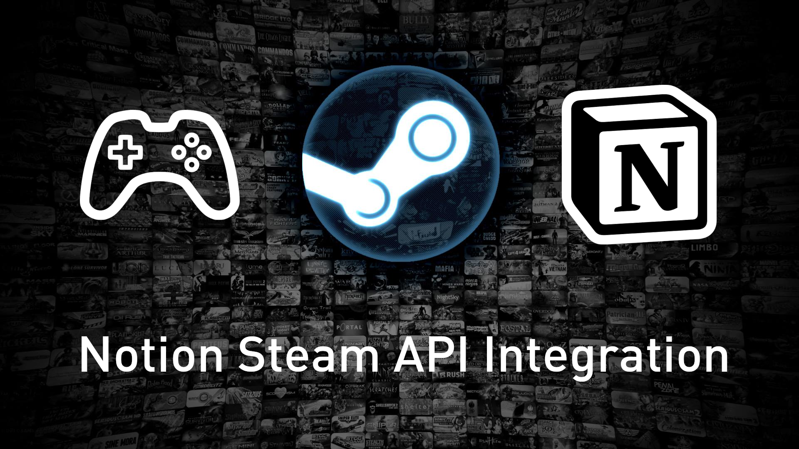
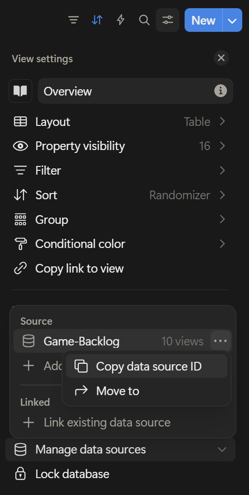

# Notion Steam API Integration



[](https://www.npmjs.com/package/notion-steam-api-integration)
[](https://github.com/NikkelM/Notion-Steam-API-Integration/actions/workflows/test.yml)
<!-- [](https://www.npmjs.com/package/notion-steam-api-integration) -->

Notion integration for automatically updating database entries containing a `Steam App ID` with data from the Steam API.

## Table of contents

- [Installation](#installation)
- [Notion setup](#notion-setup)
- [Usage](#usage)
- [Security](#security)
- [Configuration](#configuration)
- [Related projects](#related-projects)
- [Feedback](#feedback)

## Installation

Install it globally from npm to get the `notion-steam-api-integration` command:

```bash
npm install -g notion-steam-api-integration
```

Or run it on demand without installing, using `npx`:

```bash
npx notion-steam-api-integration
```

You need [Node.js](https://nodejs.org) 22.13 or newer.

## Notion setup

Create an (internal) Notion integration for your workspace to obtain an integration key.
You can follow [this guide](https://developers.notion.com/docs/create-a-notion-integration) to learn how to do so.

**IMPORTANT: Don't forget to connect the integration to your database, as described in the guide! Otherwise, the integration won't work.**

Provide the integration key via the `NOTION_INTEGRATION_KEY` environment variable (see [Security](#security)).

## Usage

There are three ways to configure and run the integration.

1. **Command-line flags** - the quickest way, using the game properties' defaults. For example:
   ```bash
   notion-steam-api-integration --database-id <yourNotionDatabaseId>
   ```
   Add `--save-config` to also write the assembled configuration to a `config.json` (or `--save-config <path>`) for reuse.
2. **The interactive wizard** - `notion-steam-api-integration init` asks you a few questions and writes a `config.json`. Running `notion-steam-api-integration` with no arguments and no `config.json` present starts this wizard automatically.
3. **A configuration file** - `notion-steam-api-integration` (or `notion-steam-api-integration run`) runs a `config.json` from the current directory (or pass `--config <path>`). The wizard can create the file for you, or you can write it by hand following the [configuration](#configuration) reference.

Once running, the integration watches the database for entries whose `Steam App ID` property (the name is configurable) is set, fetches the corresponding data from the Steam API, and fills in the configured properties.
It keeps running and re-checks the database every `updateInterval` milliseconds, so you can leave it running in the background while you edit the database.
Entries without a `Steam App ID` set are ignored.

A small local database remembers which entries have already been processed (and caches the Steam refresh token). By default it is stored in an OS-native per-user data directory (Windows `%LOCALAPPDATA%`, macOS `~/Library/Application Support`, Linux `$XDG_DATA_HOME` or `~/.local/share`), under a `notion-steam-api-integration/db` folder, so it is stable no matter where you run the integration from. Set `databasePath` in the config (or pass `--db-path <path>`) to store it somewhere else; the resolved location is printed on startup.
If you change the configuration to include new game properties, run once with `--force-reset` (or `"forceReset": true` in the config) to also set the new values for all previously discovered games.

List every command and its flags with:

```bash
notion-steam-api-integration --help
notion-steam-api-integration run --help
```

### Command-line flags

Flags let you run the integration without a `config.json`, using the default set of game properties (fetching tags is enabled only when you pass `--steam-account-name`).
For finer control over which properties are fetched, use the wizard or a config file.

| Flag | Config key | Description |
| --- | --- | --- |
| `-c, --config <path>` | - | Path to a `config.json`. Defaults to `./config.json`. |
| `--database-id <id>` | `notionDatabaseId` | Notion database ID. Providing it enables flag-driven mode (no `config.json` needed). |
| `--data-source-id <id>` | `notionDataSourceId` | Notion data source ID. Only needed for databases with multiple data sources. |
| `--interval <ms>` | `updateInterval` | How often to check the database for changes, in milliseconds (minimum 60000). |
| `--app-id-property <name>` | `steamAppIdProperty` | Name of the Notion property that holds the Steam App ID. Default `Steam App ID`. |
| `--steam-account-name <name>` | `steamUser.accountName` | Steam account name, enabling tag fetching (password via the `STEAM_PASSWORD` env var). |
| `--force-reset` | `forceReset` | Reset the local database and refresh every game on start. |
| `--always-update` | `alwaysUpdate` | Also re-update existing entries edited by someone other than the integration. |
| `--db-path <path>` | `databasePath` | Where to store the local database. Default: the OS-native per-user data directory. |
| `--save-config [path]` | - | Also write the assembled configuration to a file for reuse. Default `config.json`. |

The Notion integration key (`NOTION_INTEGRATION_KEY`) and the Steam password (`STEAM_PASSWORD`) are read from the environment (see [Security](#security)).
Nested game-property options are only available via the wizard or a config file.
The `init` command also accepts `-o, --output <path>` to write the configuration file somewhere other than `config.json`.

## Security

The integration handles two secrets:

- **Your Notion integration key** is read from the `NOTION_INTEGRATION_KEY` environment variable, or you are prompted for it interactively when the integration starts.
- **Your Steam password** (only needed to fetch tags on the first login) is read from the `STEAM_PASSWORD` environment variable, or you are prompted for it interactively.

## Configuration

### Notion database columns

Before running the integration, create the columns it fills in (or let it tell you: on the first run it checks that every configured column exists and exits with the name of any that are missing).
The names below are the defaults - rename them in your `config.json`, or disable the properties you do not want.
Print this list any time with `notion-steam-api-integration properties`.

| Property | Default column name | Notion column type |
|---|---|---|
| `gameName` | Name | Title (or Text if `isPageTitle` is `false`) |
| `coverImage` | *(page cover)* | none - sets the page cover image |
| `gameIcon` | *(page icon)* | none - sets the page icon |
| `releaseDate` | Release Date | Date |
| `reviewScore` | Review Score | Number (Select for the `sentiment` format, Text for `positive/negative`) |
| `tags` | Tags | Multi-select (requires a Steam login) |
| `gameDescription` | Description | Text |
| `storePage` | Store Page | URL |
| `gamePrice` | Price | Number |
| `steamDeckCompatibility` | Steam Deck Compatibility | Select |
| `gameDevelopers` | Developers | Multi-select |
| `gamePublishers` | Publishers | Multi-select |

You also need the column the integration watches for Steam App IDs: **Steam App ID** (Number). Set `steamAppIdProperty` to match its name.

### Schema validation

The project provides a JSON validation schema for the required configuration file, which makes sure that all required information is provided.

The schema can be found in the `config.schema.json` file and used within your `config.json` by adding the following property:

```json
"$schema": "config.schema.json"
```

*NOTE: The script will test your provided `config.json` against this schema, so make sure your configuration is valid.*

Note that *only if* you want to fetch tag data, Steam requires you to be authenticated with your Steam account.
For this, provide your Steam account name in the `steamUser.accountName` property of the configuration file and your password via the `STEAM_PASSWORD` environment variable (see [Security](#security)).
The integration does not transmit this data over the internet, everything is done locally.
If you have Steam Guard enabled, you will also need to provide the Steam Guard code when running the integration.

Once you have authenticated once, the integration will store a local refresh token for ~200 days before you need to log in again.
You can then set the `useRefreshToken` property to `true`, which will make the integration use the stored refresh token to authenticate you to the Steam API without needing your password again.

### Properties

The following is a list of all configuration items, their defaults and the values they can take.

#### Top-level properties

<details>
<summary><code>notionIntegrationKey</code></summary>

The secret integration key for your Notion integration (create or find it at https://www.notion.so/my-integrations).
**Provide this via the `NOTION_INTEGRATION_KEY` environment variable** (see [Security](#security)), storing it in the configuration file is no longer allowed, and the integration will refuse to run if it is set.

| Type | Default value | Possible values | Required |
|---|---|---|---|
| environment variable | - | A valid Notion integration key | Yes, via `NOTION_INTEGRATION_KEY` |
</details>

<details>
<summary><code>notionDatabaseId</code></summary>

The ID of the database you want to run the integration on. You can find the ID in the URL of your database, e.g. https://www.notion.so/myworkspace/your-database-id.

| Type | Default value | Possible values | Required |
|---|---|---|---|
| `string` | `""` | A valid Notion database ID | Yes |
</details>

<details>
<summary><code>notionDataSourceId</code></summary>

The ID of the data source you want to run the integration on. This is required if you have multiple data sources in your database. You can find the ID under the `Manage data sources` menu in the database settings. If you only have one data source (which is the default), you can leave this property empty.



| Type | Default value | Possible values | Required |
|---|---|---|---|
| `string` | `""` | A valid data source ID of one of the data sources in your database | Yes, if you have multiple data sources in your database. |
</details>

<details>
<summary><code>updateInterval</code></summary>

The interval in which the integration will check for updates to your Notion database. The value is in milliseconds. Must be at least 60000 (1 minute).

| Type | Default value | Possible values | Required |
|---|---|---|---|
| `integer` | 60000 | Integers >= 60000 | Yes |
</details>

<details>
<summary><code>steamAppIdProperty</code></summary>

The name of the property in your Notion database that contains the Steam App ID of the games.

| Type | Default value | Possible values | Required |
|---|---|---|---|
| `string` | `"Steam App ID"` | Any string | Yes |
</details>

<details>
<summary><code>forceReset</code></summary>

If true, the integration will reset the local database, fetch all Steam App ID's from the Notion database and refresh all game properties. This may take longer, depending on the size of your Notion database.

| Type | Default value | Possible values | Required |
|---|---|---|---|
| `boolean` | `false` | `true` or `false` | No |
</details>

<details>
<summary><code>alwaysUpdate</code></summary>

If true, the integration will always update entries in the Notion database that were modified since it last ran, even if the game already exists in the local database. It will only update if another user than the integration has last modified the entry.

| Type | Default value | Possible values | Required |
|---|---|---|---|
| `boolean` | `false` | `true` or `false` | No |
</details>

<details>
<summary><code>steamUser</code></summary>

Steam login details, only required to fetch tag data. Provide your account name here and your password via the `STEAM_PASSWORD` environment variable (see [Security](#security)), storing the password in the configuration file is no longer allowed. If you have Steam Guard enabled, you will be prompted for the code when the integration runs. Once logged in, the integration stores a local refresh token for ~200 days before you need to log in again. It does not store your password. If you do not fetch tag data, you do not need this property!

| Property | Default value | Possible values | Required |
|---|---|---|---|
| `accountName` | `<steamAccountName>` | Your Steam account name | Yes, to fetch tags, unless a valid refresh token is already stored. |
| `useRefreshToken` | `false` | `true` or `false` | No. Set to `true` to reuse a stored refresh token from a previous login without providing your password again. |

Your Steam password is **not** part of this property, provide it via the `STEAM_PASSWORD` environment variable when logging in for the first time.
</details>

<details>
<summary><code>gameProperties</code></summary>

Which game properties should be fetched when a new Steam game is detected, and the name of the corresponding field in the Notion database.

| Type | Default value | Possible values | Required |
|---|---|---|---|
| `object` | See item below | See sections below | Yes, and at least one property set. |

```json
"gameProperties": {
	"gameName": {
		"enabled": true,
		"notionProperty": "Name",
		"isPageTitle": true
	},
	"coverImage": {
		"enabled": true,
		"default": "https://cdn.cloudflare.steamstatic.com/store/home/store_home_share.jpg"
	},
	"gameIcon": {
		"enabled": true,
		"default": "https://help.steampowered.com/public/shared/images/responsive/share_steam_logo.png"
	},
	"releaseDate": {
		"enabled": true,
		"notionProperty": "Release Date"
	},
	"reviewScore": {
		"enabled": true,
		"format": "percentage",
		"notionProperty": "Review Score"
	},
	"tags": {
		"enabled": true,
		"notionProperty": "Tags",
		"tagLanguage": "english"
	}
}
```
</details>

#### gameProperties

<details>
<summary><code>gameName</code></summary>

The name of the game as it appears on Steam. The database field in Notion must be of type `Text`.

| Type | Default value | Possible values | Required |
|---|---|---|---|
| `object` | See item below | See sections below | No |

```json
"gameName": {
	"enabled": true,
	"notionProperty": "Name",
	"isPageTitle": true
}
```

<h3>Possible values</h3>

<h4><code>enabled</code></h4>

Whether or not the name of the game should be set in the database.

| Type | Default value | Possible values | Required |
|---|---|---|---|
| `boolean` | `true` | `true` or `false` | Yes |

<h4><code>notionProperty</code></h4>

The name of the Notion property to set the game name in.

| Type | Default value | Possible values | Required |
|---|---|---|---|
| `string` | `"Name"` | A valid Notion property name | Yes |

<h4><code>isPageTitle</code></h4>

Indicates if this property is the "Title" of the Notion page or not.

| Type | Default value | Possible values | Required |
|---|---|---|---|
| `boolean` | `true` | `true` or `false` | No |
</details>

<details>
<summary><code>coverImage</code></summary>

The cover image of the game as it appears on the shop page. Will be set as the cover image for the page if enabled.

| Type | Default value | Possible values | Required |
|---|---|---|---|
| `object` | See item below | See sections below | No |

```json
"coverImage": {
	"enabled": true,
	"default": "https://cdn.cloudflare.steamstatic.com/store/home/store_home_share.jpg"
}
```

<h3>Possible values</h3>

<h4><code>enabled</code></h4>

Whether or not the cover image of the game should be set in the database.

| Type | Default value | Possible values | Required |
| --- | --- | --- | --- |
| `boolean` | `true` | `true` or `false` | Yes |

<h4><code>default</code></h4>

The URL of the image to use if the game does not have a cover image through any of the two API's.

| Type | Default value | Possible values | Required |
| --- | --- | --- | --- |
| `string` | `"https://cdn.cloudflare.steamstatic.com/store/home/store_home_share.jpg"` | A valid URL | Yes |
</details>

<details>
<summary><code>gameIcon</code></summary>

The icon of the game as it appears in the game library. Will be set as the icon for the page if enabled.

| Type | Default value | Possible values | Required |
|---|---|---|---|
| `object` | See item below | See sections below | No |

```json
"gameIcon": {
	"enabled": true,
	"default": "https://help.steampowered.com/public/shared/images/responsive/share_steam_logo.png"
}
```

<h3>Possible values</h3>

<h4><code>enabled</code></h4>

Whether or not the icon of the game should be set in the database.

| Type | Default value | Possible values | Required |
|---|---|---|---|
| `boolean` | `true` | `true` or `false` | Yes |

<h4><code>default</code></h4>

The URL of the image to use if the game does not have an icon through any of the two API's.

| Type | Default value | Possible values | Required |
|---|---|---|---|
| `string` | `"https://help.steampowered.com/public/shared/images/responsive/share_steam_logo.png"` | A valid URL | Yes |
</details>

<details>
<summary><code>releaseDate</code></summary>

The release date of the game. The database field in Notion must be of type `Date`.

| Type | Default value | Possible values | Required |
|---|---|---|---|
| `object` | See item below | See sections below | No |

```json
"releaseDate": {
	"enabled": true,
	"notionProperty": "Release Date"
}
```

<h3>Possible values</h3>

<h4><code>enabled</code></h4>

Whether or not the release date of the game should be set in the database.

| Type | Default value | Possible values | Required |
|---|---|---|---|
| `boolean` | `true` | `true` or `false` | Yes |

<h4><code>notionProperty</code></h4>

The name of the Notion property to set the release date in.

| Type | Default value | Possible values | Required |
|---|---|---|---|
| `string` | `"Release Date"` | A valid Notion property name | Yes |
</details>

<details>
<summary><code>reviewScore</code></summary>

The user review score for the game, formatted as one of a number of options. The database field in Notion must match the type defined by the chosen "format".

| Type | Default value | Possible values | Required |
|---|---|---|---|
| `object` | See item below | See sections below | No |

```json
"reviewScore": {
	"enabled": true,
	"format": "percentage",
	"notionProperty": "Review Score"
}
```

<h3>Possible values</h3>

<h4><code>enabled</code></h4>

Whether or not the user review score should be set in the database.

| Type | Default value | Possible values | Required |
|---|---|---|---|
| `boolean` | `true` | `true` or `false` | Yes |

<h4><code>format</code></h4>

How the review score should be formatted.

| Type | Default value | Possible values | Required |
|---|---|---|---|
| `string` | `percentage` | `percentage`: Notion database field type: `Number`. A percentage value formatted as a float from 0.00-1.00.<br/>`sentiment`:Notion database field type: `Select`. A sentiment value such as "Overwhelmingly Positive" or "Mixed".<br/>`total`:Notion database field type: `Number`. The total number of reviews submitted for the game, across all languages.<br/>`positive`:Notion database field type: `Number`. The total number of positive reviews submitted for the game, across all languages.<br/>`negative`:Notion database field type: `Number`. The total number of negative reviews submitted for the game, across all languages.<br/>`positive/negative`:Notion database field type: `Text`. The total number of positive and negative reviews submitted for the game, across all languages, formatted as "{numPositive} positive / {numNegative} negative". | Yes |

<h4><code>notionProperty</code></h4>

The name of the Notion property to set the user review score in.

| Type | Default value | Possible values | Required |
|---|---|---|---|
| `string` | `"Review Score"` | A valid Notion property name | Yes |
</details>

<details>
<summary><code>tags</code></summary>

Requires Steam login! Provide accountName and password in the top-level `steamUser` property! The user-defined tags of the game as they can be seen on the store page. The database field in Notion must be of type `Multi-select`.

| Type | Default value | Possible values | Required |
|---|---|---|---|
| `object` | See item below | See sections below | No |

```json
"tags": {
	"enabled": true,
	"notionProperty": "Tags",
	"tagLanguage": "english"
}
```

<h3>Possible values</h3>

<h4><code>enabled</code></h4>

Whether or not the tags of the game should be set in the database.

| Type | Default value | Possible values | Required |
|---|---|---|---|
| `boolean` | `true` | `true` or `false` | Yes |

<h4><code>notionProperty</code></h4>

The name of the Notion property to set the tags in. This field must be of type `Multi-select`.

| Type | Default value | Possible values | Required |
|---|---|---|---|
| `string` | `"Tags"` | A valid Notion property name | Yes |

<h4><code>tagLanguage</code></h4>

The language of the tags, e.g. "english" or "spanish".

| Type | Default value | Possible values | Required |
|---|---|---|---|
| `string` | `"english"` | Valid full language names. Invalid names return an error from the Steam API. | Yes |

</details>

<details>
<summary><code>gameDescription</code></summary>

The short description of the game as it appears on the store page. The database field in Notion must be of type `Text`.

| Type | Default value | Possible values | Required |
|---|---|---|---|
| `object` | See item below | See sections below | No |

```json
"gameDescription": {
	"enabled": true,
	"notionProperty": "Description"
}
```

<h3>Possible values</h3>

<h4><code>enabled</code></h4>

Whether or not the description of the game should be set in the database.

| Type | Default value | Possible values | Required |
|---|---|---|---|
| `boolean` | `true` | `true` or `false` | Yes |

<h4><code>notionProperty</code></h4>

The name of the Notion property to set the description in.

| Type | Default value | Possible values | Required |
|---|---|---|---|
| `string` | `"Description"` | A valid Notion property name | Yes |
</details>

<details>
<summary><code>storePage</code></summary>

The URL to the store page of the game. The database field in Notion must be of type `URL`.

| Type | Default value | Possible values | Required |
|---|---|---|---|
| `object` | See item below | See sections below | No |

```json
"storePage": {
	"enabled": true,
	"notionProperty": "Store Page"
}
```

<h3>Possible values</h3>

<h4><code>enabled</code></h4>

Whether or not the store page URL should be set in the database.

| Type | Default value | Possible values | Required |
|---|---|---|---|
| `boolean` | `true` | `true` or `false` | Yes |

<h4><code>notionProperty</code></h4>

The name of the Notion property to set the store page URL in.

| Type | Default value | Possible values | Required |
|---|---|---|---|
| `string` | `"Store Page"` | A valid Notion property name | Yes |
</details>

<details>
<summary><code>gamePrice</code></summary>

The price of the game on Steam. Does not account for current sales or discounts (as this data would be outdated too quickly). The currency depends on your current country. The database field in Notion must be of type `Number`.

| Type | Default value | Possible values | Required |
|---|---|---|---|
| `object` | See item below | See sections below | No |

```json
"gamePrice": {
	"enabled": true,
	"notionProperty": "Price"
}
```

<h3>Possible values</h3>

<h4><code>enabled</code></h4>

Whether or not the price of the game should be set in the database.

| Type | Default value | Possible values | Required |
|---|---|---|---|
| `boolean` | `true` | `true` or `false` | Yes |

<h4><code>notionProperty</code></h4>

The name of the Notion property to set the price in.

| Type | Default value | Possible values | Required |
|---|---|---|---|
| `string` | `"Price"` | A valid Notion property name | Yes |
</details>

<details>
<summary><code>steamDeckCompatibility</code></summary>

The Steam Deck Compatibility score, which can be one of "Verified", "Playable", "Unsupported" or "Unknown". The database field in Notion must be of type `Select`.

| Type | Default value | Possible values | Required |
|---|---|---|---|
| `object` | See item below | See sections below | No |

```json
"steamDeckCompatibility": {
	"enabled": true,
	"notionProperty": "Steam Deck Compatibility"
}
```

<h3>Possible values</h3>

<h4><code>enabled</code></h4>

Whether or not the Steam Deck Compatibility score should be set in the database.

| Type | Default value | Possible values | Required |
|---|---|---|---|
| `boolean` | `true` | `true` or `false` | Yes |

<h4><code>notionProperty</code></h4>

The name of the Notion property to set the Steam Deck Compatibility score in.

| Type | Default value | Possible values | Required |
|---|---|---|---|
| `string` | `"Steam Deck Compatibility"` | A valid Notion property name | Yes |
</details>

<details>
<summary><code>gameDevelopers</code></summary>

The developer(s) of the game. The database field in Notion must be of type `Multi-select`.

| Type | Default value | Possible values | Required |
|---|---|---|---|
| `object` | See item below | See sections below | No |

```json
"gameDevelopers": {
	"enabled": true,
	"notionProperty": "Developers"
}
```

<h3>Possible values</h3>

<h4><code>enabled</code></h4>

Whether or not the developer(s) of the game should be set in the database.

| Type | Default value | Possible values | Required |
|---|---|---|---|
| `boolean` | `true` | `true` or `false` | Yes |

<h4><code>notionProperty</code></h4>

The name of the Notion property to set the developer(s) in.

| Type | Default value | Possible values | Required |
|---|---|---|---|
| `string` | `"Developers"` | A valid Notion property name | Yes |
</details>

<details>
<summary><code>gamePublishers</code></summary>

The publisher(s) of the game. The database field in Notion must be of type `Multi-select`.

| Type | Default value | Possible values | Required |
|---|---|---|---|
| `object` | See item below | See sections below | No |

```json
"gamePublishers": {
	"enabled": true,
	"notionProperty": "Publishers"
}
```

<h3>Possible values</h3>

<h4><code>enabled</code></h4>

Whether or not the publisher(s) of the game should be set in the database.

| Type | Default value | Possible values | Required |
|---|---|---|---|
| `boolean` | `true` | `true` or `false` | Yes |

<h4><code>notionProperty</code></h4>

The name of the Notion property to set the publisher(s) in.

| Type | Default value | Possible values | Required |
|---|---|---|---|
| `string` | `"Publishers"` | A valid Notion property name | Yes |
</details>

## Related projects

You can get a list of all games you own on Steam, Epic Games or GOG using the [Steam App ID Finder](https://github.com/NikkelM/Steam-App-ID-Finder). This project also includes a utility to get the Steam App IDs from just a list of game names.

Do you want to add games that are available on Game Pass to your Notion database? Use the [Game Pass API](https://github.com/NikkelM/Game-Pass-API) to get the data you need.

If have data in the form of a complex JSON file, you can use the [JSON to Notion](https://github.com/NikkelM/JSON-to-Notion) tool to import all the required properties to your Notion database - this tool works great with the [Game Pass API](https://github.com/NikkelM/Game-Pass-API).

## Feedback

If you have any question, feedback or feature requests, feel free to open an [issue](https://github.com/NikkelM/Notion-Steam-API-Integration/issues/new).
